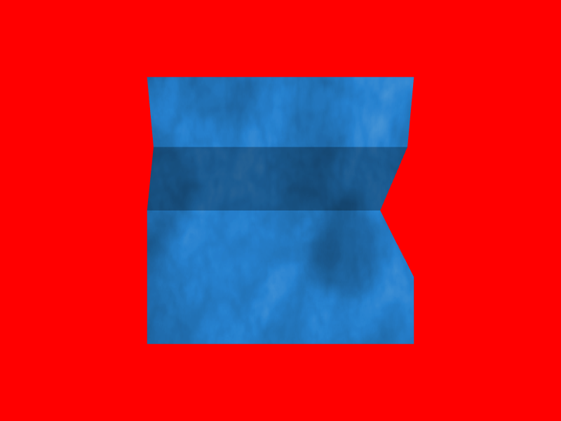

# Table of contents

* [Overview](#overview)
* [Steps](#steps)
    * [4.1. Introduce debugging support](#debug)
        * [4.1.1. Technologies](#debug-tech)
        * [4.1.2. Internal representation](#debug-representation)
        * [4.1.3. Usage](#debug-usage)
    * [4.2. Debug camera](#debug-camera)
        * [4.2.1. Install camera manipulator](#debug-camera-manipulator)
        * [4.2.2. Create debug page for camera](#debug-camera-page)
        * [4.2.3. Retrieve position and rotation](#debug-camera-posrot)
        * [4.2.4. Alter background color](#debug-camera-bgcolor)
        * [4.2.5. Add camera's debug page to Debugger](#debug-camera-debugger)
* [Result](#result)

<a name="overview"/>

# Overview

This example is part of [OpenSceneGraph cross-platform examples][osgcpe].

In this example we implement [debug-broker][debug-broker]'s protocol to support remote
debugging across platforms.

**Note**: this example requires [03.HTTPClient example][ex03] knowledge.

<a name="steps"/>

# Steps

<a name="debug"/>

## 4.1. Introduce debugging support

Remote debugging assumes application and debug UI are located at different
machines. The most widespread way to communicate between remote machines
nowadays is to use HTTP(s) over TCP/IP.

We use [debug-broker][debug-broker]'s protocol to implement remote debugging.
`debug-broker` is a mediator between debugged application (this example) and
debug UI (source of user input).

<a name="debug-tech"/>

### 4.1.1. Technologies

`debug-broker` has the following concepts:

* Debugger
    * is a container of so-called debug pages
    * usually represents a single application
    * requires client code to call its `process()` function regularly to perform requests
* Page
    * is a container of so-called debug items
    * usually represents a set of related items, e.g., `Camera` properties
* Item
    * contains alterable entries
    * usually represents properties, e.g., `BackgroundColor` item for `Camera` page
    * can be read-only or read-write

`debug-broker` accepts and replies in JSON format. We use
[NLohmann's JSON][nlohmann-json] to parse incoming JSON. Outgoing JSON
is currently composed manually.

**Note**: clone [NLohmann's JSON][nlohmann-json] alongside OpenSceneGraph
cross-platfrom examples' repository.

<a name="debug-representation"/>

### 4.1.2. Internal representation

`debug-broker` concepts are mapped to the following classes:

* [Debugger][Debugger]
    * is a container for `Page`s
    * uses `HTTPClient` instance to communicate with `debug-broker`
    * makes new request
        * each second
        * only after previous request has been completed
* [Page][Page]
    * is a container for `Page::Item`s
* [Page::Item][PageItem]
    * is an entry with alterable value

<a name="debug-usage"/>

### 4.1.3. Usage

Client code:

* creates `Debugger` instance ([source code][Debugger-create]):
    ```
    this->debugger = new debug::Debugger(this->httpClient, name);
    ```
* provides `debug-broker`'s address ([source code][Debugger-address]):
    ```
    this->debugger->setBrokerURL("http://localhost:7999");
    ```
* regularly calls `Debugger`'s `process()` function ([source code][Debugger-process]):
    ```
    this->debugger->process();
    ```

<a name="debug-camera"/>

## 4.2. Debug camera

Now that we covered prerequisites, it's time to debug.

Let's debug camera:

* alter background color
* retrieve camera's position and rotation

<a name="debug-camera-manipulator"/>

### 4.2.1. Install camera manipulator

We can only get camera's position from camera manipulator.
Install one ([source code][camera-manipulator]):
```
this->cameraManip = new osgGA::TrackballManipulator;
this->viewer->setCameraManipulator(this->cameraManip);
```

<a name="debug-camera-page"/>

### 4.2.2. Create debug page for camera

Create debug page to collect camera related items
([source code][camera-page]):
```
- - - -
debug::Page debugPage;
- - - -
this->debugPage.title = "camera";
- - - -
```

<a name="debug-camera-posrot"/>

### 4.2.3. Retrieve position and rotation

To retrieve camera's position and rotation, we need to register
`Postion/Rotation` item with getter
([source code][camera-posrot]):
```
this->debugPage.addItem(
    "Position/Rotation",
    // Getter.
    [&] {
        - - - -
        return
            format::printfString(
                "%f,%f,%f/%f,%f,%f",
                pos.x(), pos.y(), pos.z(),
                rot.x(), rot.y(), rot.z()
            );
    }
);

```

<a name="debug-camera-bgcolor"/>

### 4.2.4. Alter background color

To alter background (camera) color, we need to register
`BGColor` item with both getter and setter
([source code][camera-bgcolor]):
```
this->debugPage.addItem(
    "BGColor",
    // Getter.
    [&] {
        - - - -
        return format::printfString("%d,%d,%d", r, g, b);
    },
    // Setter.
    [&](const std::string &value) {
        - - - -
        this->camera()->setClearColor(color);
    }
);

```

<a name="debug-camera-debugger"/>

### 4.2.5. Add camera's debug page to Debugger

Finally, add camera's debug page to `Debugger`
([source code][camera-debugger]):
```
this->debugger->addPage(this->debugPage);
```

<a name="result"/>

# Result



Here's a [web build of the example][web-build].

Now open [debug UI][debug-ui] and change background color to `255,0,0`.

[osgcpe]: https://github.com/OGStudio/openscenegraph-cross-platform-examples
[ex03]: ../03.HTTPClient
[debug-broker]: https://github.com/OGStudio/debug-broker
[nlohmann-json]: https://github.com/nlohmann/json

[fetch-api]: https://kripken.github.io/emscripten-site/docs/api_reference/fetch.html
[emscripten]: http://emscripten.org
[xhr]: https://en.wikipedia.org/wiki/XMLHttpRequest
[mongoose]: https://github.com/cesanta/mongoose

[Debugger]: desktop/src/debug.h#L246
[Page]: desktop/src/debug.h#L99
[PageItem]: desktop/src/debug.h#L114

[Debugger-create]: desktop/src/main.h#L335
[Debugger-address]: desktop/src/main.h#L336
[Debugger-process]: desktop/src/main.h#L341

[camera-manipulator]: desktop/src/main.h#L315
[camera-page]: desktop/src/main.h#L350
[camera-posrot]: desktop/src/main.h#L390
[camera-bgcolor]: desktop/src/main.h#L360
[camera-debugger]: desktop/src/main.h#L357

[web-build]: https://ogstudio.github.io/openscenegraph-cross-platform-examples-web-builds/examples/04/ex04-remote-debugging.html
[debug-ui]: https://ogstudio.github.io/debug-ui/?broker=https%3A%2F%2Fosgcpe-debug-broker.herokuapp.com&debugger=Ex04&page=camera
