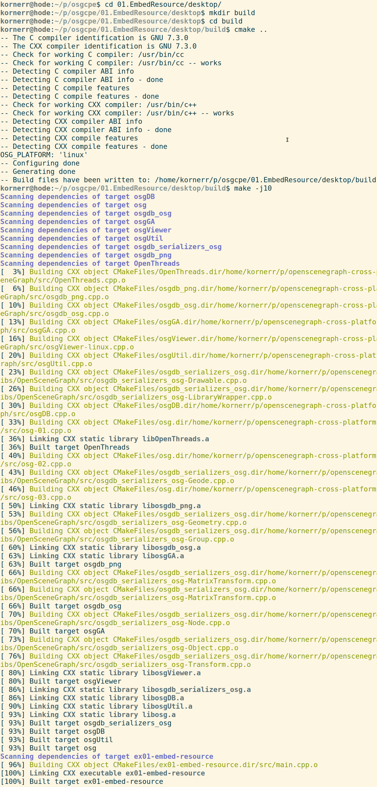
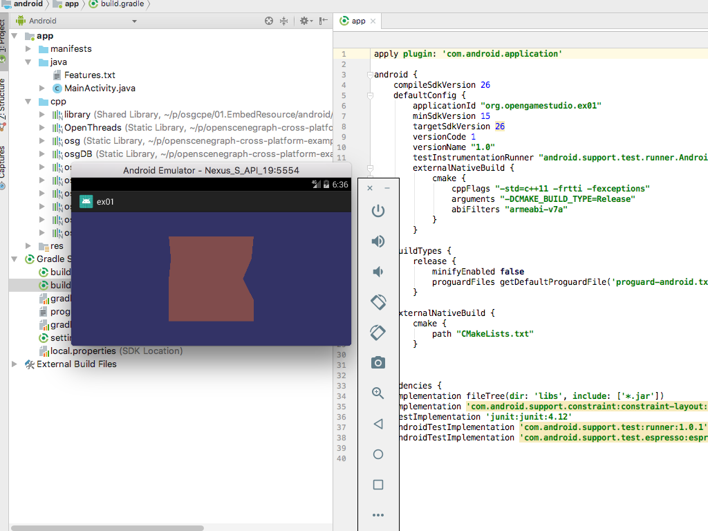
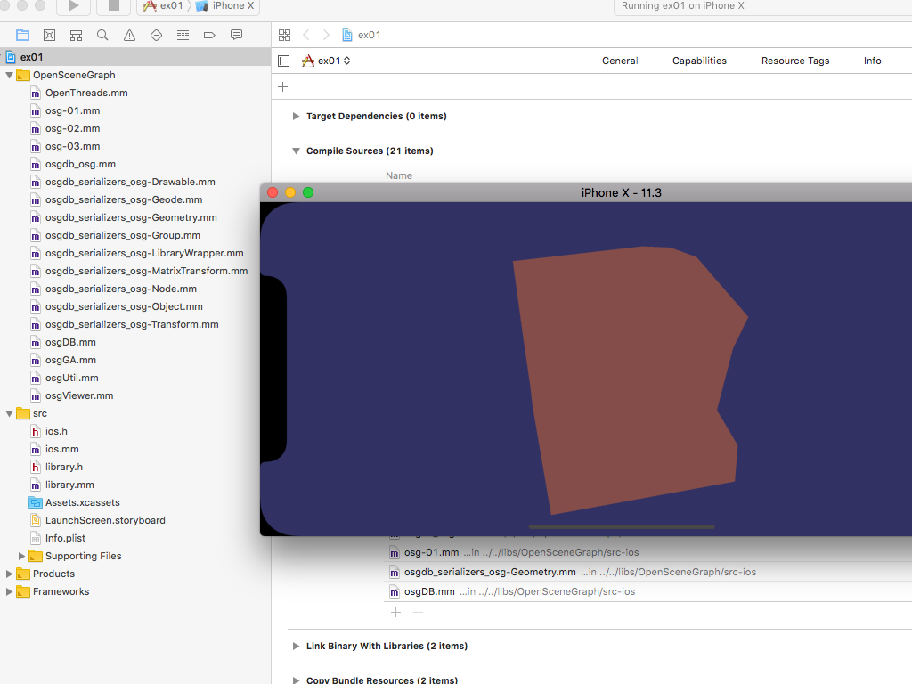

# Table of contents

* [Overview](#overview)
* [How to build](#build)
    * [Desktop](#build-desktop)
    * [Android](#build-android)
    * [iOS](#build-ios)
    * [Web](#build-web)
* [Examples](#examples)
  * [01. Embed resource into executable](#examples-embed-resource)
  * [02. Load PNG images with PNG/ImageIO plugins](#examples-images)
* [Help](#help)

<a name="overview"/>

# Overview

[OpenSceneGraph](http://openscenegraph.org) is an open source high performance
3D graphics toolkit, used by application developers in fields such as visual
simulation, games, virtual reality, scientific visualization and modelling.

This document is a collection of examples to perform specific tasks. This
document is a logical continuation of [OpenSceneGraph cross-platform guide][osgcpg], which
can be seen as an introduction to working with OpenSceneGraph.

This document, unlike [OpenSceneGraph cross-platform guide][osgcpg], only contains examples,
not tutorials with screenshots and videos. Here, you find a solution for a specific
problem only.

Examples run on the following platforms:

* Linux
* macOS
* Windows
* Android
* iOS
* Web

**Note**: please, make yourself familiar with [OpenSceneGraph cross-platform guide][osgcpg]
before trying examples.

<a name="build"/>

# How to build

Each example contains four implementations to cover all supported platforms:

* desktop (Linux, macOS, Windows)
* android
* ios
* web

<a name="build-desktop"/>

## Desktop

  

**Note**: you must have OpenSceneGraph installation. See [OpenSceneGraph cross-platform guide][osgcpg] for details.

To build `01.EmbedResource` example for desktop, run the following commands:

```
cd 01.EmbedResource/desktop
mkdir build
cd build
cmake ..
make
```

To launch the first example, run the following command:

`./ex01-embed-resource`

<a name="build-android"/>

## Android

  

**Notes**:

* You must have OpenSceneGraph sources alongside this repository clone (see [OpenSceneGraph cross-platform guide][osgcpg] for details)
* Android project is built for `armeabi-v7a` architecture by default (update `abiFilters` value in `android/app/build.gradle` if you want other platforms)

To build and run `01.EmbedResource` example for Android, you open
`01.EmbedResource/android` in Android Studio and run the project.

<a name="build-ios"/>

## iOS

  

**Note**: you must have OpenSceneGraph sources alongside this repository clone (see [OpenSceneGraph cross-platform guide][osgcpg] for details)

First, build example library (for each example) for Simulator and Device:

```
cd 01.EmbedResource/ios

# Simulator.
mkdir -p build/Simulator
cd build/Simulator
cmake -G Xcode -DIPHONE_ENABLE_BITCODE=YES ../..
cmake --build . --config Release -- -IDEBuildOperationMaxNumberOfConcurrentCompileTasks=8

cd ../..

# Device.
mkdir -p build/Device
cd build/Device
cmake -G Xcode -DIPHONE_ENABLE_BITCODE=YES -DBUILD_SIMULATOR=NO ../..
cmake --build . --config Release -- -IDEBuildOperationMaxNumberOfConcurrentCompileTasks=8
```

**Notes**:

* the first time you build might take a while because OpenSceneGraph needs to be built, too
* the process of building for Device might fail for some plugins, don't worry: the necessary libraries has already been built by that time

Second, open `01.EmbedResource/ios/xcodeproject/ex01.xcodeproj` Xcode project and run it.

<a name="build-web"/>

## Web

  

**Note**: you must have OpenSceneGraph sources alongside this repository clone (see [OpenSceneGraph cross-platform guide][osgcpg] for details)

To build `01.EmbedResource` example for web, run the following commands:

```
cd 01.EmbedResource/web
mkdir build
cd build
cmake -DCMAKE_TOOLCHAIN_FILE=/path/to/emsdk-portable/emscripten/<version>/cmake/Modules/Platform/Emscripten.cmake ..
make -j8 ex01-embed-resource
```

**Notes**: the first time you build might take a while because OpenSceneGraph needs to be built, too

To launch the first example, open `ex01-embed-resource.html` file in Firefox.

To launch examples in any web browser, you need to serve the files with a web server.
E.g., you can serve locally like this:

* serve with the following commands:
    ```
    cd 01.EmbedResource/web/build
    python -m SimpleHTTPServer
    ```
* open [http://localhost:8000](http://localhost:8000) in any web browser

<a name="examples"/>

# Examples

<a name="examples-embed-resources"/>

### [01. Embed resources into executable](01.EmbedResource/README.md)

  

  Learn how to use `xxd` Unix utility to convert any binary file (in our case,
  it's box.osgt model) into
  C header file and use it across platforms with OpenSceneGraph.

<a name="examples-images"/>

### [02. Use images with PNG/ImageIO plugins](02.Images)

  

  Learn how to build PNG/ImageIO plugins across platforms and reference built-in
  PNG images using simple shaders.

<a name="help"/>

Help
====

Feel free to [ask questions][issues] in the issues. Your questions help us
improve examples.

[osgcpg]: https://github.com/OGStudio/openscenegraph-cross-platform-guide
[issues]: https://github.com/OGStudio/openscenegraph-cross-platform-examples/issues

