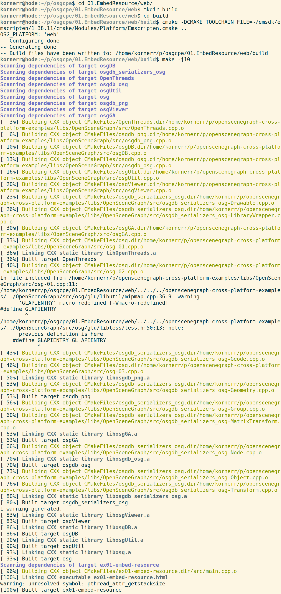

# Table of contents

* [Overview](#overview)
* [How to build](#build)
    * [Desktop](#build-desktop)
    * [Android](#build-android)
    * [iOS](#build-ios)
    * [Web](#build-web)
* [Examples](#examples)
    * [01. Embed resource into executable](#examples-embed-resource)
    * [02. Use PNG images with PNG plugins](#examples-images)
* [Entity hierarchy](#hierarchy)
* [Help](#help)

<a name="overview"/>

# Overview

[OpenSceneGraph](http://openscenegraph.org) is an open source high performance
3D graphics toolkit, used by application developers in fields such as visual
simulation, games, virtual reality, scientific visualization and modelling.

This document is a collection of examples to perform specific tasks. This
document is a logical continuation of [OpenSceneGraph cross-platform guide][osgcpg], which
can be seen as an introduction to working with OpenSceneGraph.

This document, unlike [OpenSceneGraph cross-platform guide][osgcpg], only contains examples,
not tutorials with screenshots and videos. Here, you find a solution for a specific
problem only.

Examples run on the following platforms:

* Linux
* macOS
* Windows
* Android
* iOS
* Web

**Note**: please, make yourself familiar with [OpenSceneGraph cross-platform guide][osgcpg]
before trying examples.

<a name="build"/>

# How to build

Each example contains four implementations to cover all supported platforms:

* desktop (Linux, macOS, Windows)
* android
* ios
* web

**Plugin notes**:

* desktop builds
    * OpenSceneGraph plugins are referenced at run-time
    * plugins should be located in a directory where dynamic linker looks for libraries
* non-desktop builds
    * OpenSceneGraph plugins are linked with at build time
    * plugins should be explicitely referenced in code with `USE_OSGPLUGIN` macro

<a name="build-desktop"/>

## Desktop

  

**Notes**:

* you must have OpenSceneGraph installation (see [OpenSceneGraph cross-platform guide][osgcpg] for details)
* you may need to specify OpenSceneGraph include and library directories with `-DOSG_INC_DIR=/path/to/OSG/includes` and `-DOSG_LIB_DIR=/path/to/OSG/libs` during `cmake` invocation if OpenSceneGraph is located in non-standard location

To build `01.EmbedResource` example for desktop, run the following commands:

```
cd 01.EmbedResource/desktop
mkdir build
cd build
cmake ..
make
```

To launch the first example, run the following command:

`./ex01-embed-resource`

<a name="build-android"/>

## Android

  

**Notes**:

* you must have OpenSceneGraph sources alongside this repository clone (see [OpenSceneGraph cross-platform guide][osgcpg] for details)
* Android project is built for `armeabi-v7a` architecture by default (update `abiFilters` value in `android/app/build.gradle` if you want other platforms)
* make sure to run `Tools -> Android -> Sync Project with Gradle Files` in Android Studio after opening each example, this is necessary for Android Studio to create internal project files
* each example builds its own version of OpenSceneGraph under `/path/to/OpenSceneGraph/build/Android-<ABI_VERSION>/Ex<Number>` because different examples require different OpenSceneGrah plugins

To build and run `01.EmbedResource` example for Android, you open
`01.EmbedResource/android` in Android Studio and run the project.

<a name="build-ios"/>

## iOS

  

First, build example library (for each example) for Simulator and Device:

```
cd 01.EmbedResource/ios

# Simulator.
mkdir -p build/Simulator
cd build/Simulator
cmake -G Xcode -DIPHONE_ENABLE_BITCODE=YES ../..
cmake --build . --config Release -- -IDEBuildOperationMaxNumberOfConcurrentCompileTasks=8

cd ../..

# Device.
mkdir -p build/Device
cd build/Device
cmake -G Xcode -DIPHONE_ENABLE_BITCODE=YES -DBUILD_SIMULATOR=NO ../..
cmake --build . --config Release -- -IDEBuildOperationMaxNumberOfConcurrentCompileTasks=8
```

**Notes**:

* you must have OpenSceneGraph sources alongside this repository clone (see [OpenSceneGraph cross-platform guide][osgcpg] for details)
* each example builds its own version of OpenSceneGraph under `/path/to/OpenSceneGraph/build/<Device|Simulator>/Ex<Number>` because different examples require different OpenSceneGrah plugins
* you may encounter quite a few build errors
    * `Undefined symbols for architecture <Arch>` errors with `library::`: remove OpenSceneGraph build and retry
    * failure to build some plugins either due to missing headers (like curl), or wrong `-std=c++11` directive:
        * rerun `cmake .` to refresh CMake cache files
        * retry the build command to make sure iOS library (rawex01/02/etc) has been built
    * if some plugins are not built and above steps don't work, you may try to build missing libraries manually by appending `-target` to `cmake` command, e.g., `-target osgdb_osg` 

Second, open `01.EmbedResource/ios/xcodeproject/ex01.xcodeproj` Xcode project and run it.

<a name="build-web"/>

## Web

  

To build `01.EmbedResource` example for web, run the following commands:

```
cd 01.EmbedResource/web
mkdir build
cd build
cmake -DCMAKE_TOOLCHAIN_FILE=/path/to/emsdk-portable/emscripten/<version>/cmake/Modules/Platform/Emscripten.cmake ..
make -j8 ex01-embed-resource
```

**Note**: you must have OpenSceneGraph sources alongside this repository clone (see [OpenSceneGraph cross-platform guide][osgcpg] for details)

To launch the first example, open `ex01-embed-resource.html` file in Firefox.

To launch examples in any web browser, you need to serve the files with a web server.
E.g., you can serve locally like this:

* serve with the following commands:
    ```
    cd 01.EmbedResource/web/build
    python -m SimpleHTTPServer
    ```
* open [http://localhost:8000](http://localhost:8000) in any web browser

<a name="examples"/>

# Examples

<a name="examples-embed-resources"/>

### [01. Embed resource into executable](01.EmbedResource/README.md)

  

  Learn how to embed a binary resource into application with `xxd` Unix utility
  and use the resource across platforms.

<a name="examples-images"/>

### [02. Use PNG images with PNG plugins](02.TextureImage)

  

  Learn how to use PNG images across platforms with PNG plugins.

<a name="hierarchy"/>

# Entity hierarchy

Here's an overview of parent-child relationship among source code entities along with brief description of their responsibilities: [Entity hierarchy][entity-hierarchy].

<a name="help"/>

Help
====

Feel free to [ask questions][issues] in the issues. Your questions help us
improve examples.

[osgcpg]: https://github.com/OGStudio/openscenegraph-cross-platform-guide
[issues]: https://github.com/OGStudio/openscenegraph-cross-platform-examples/issues
[entity-hierarchy]: https://github.com/OGStudio/openscenegraph-cross-platform-examples/entity-hierarchy.html

